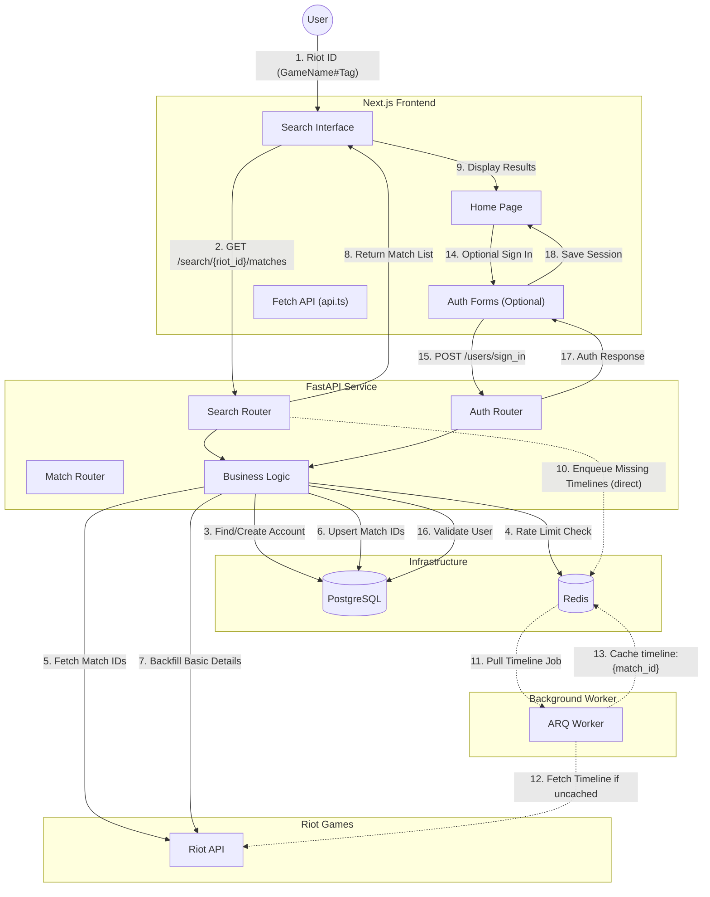

# Request Flow: Search to Home (with Optional Auth)

This document outlines the high-level request flow for the `league-match-analyzer` application, specifically illustrating how microservices and technologies interact when a user searches for match data and optionally signs in for persistent features.

## System Components

- **Frontend**: Next.js 16 (React Server Components + Client Hooks)
- **Backend**: FastAPI (Async Python)
- **Worker**: ARQ (Async Redis Queue)
- **Infrastructure**: PostgreSQL (Data), Redis (Cache/Queue/Rate Limits)
- **External**: Riot Games API

## High-Level Flow Diagram

```mermaid
graph TD
  %% Nodes
  User((User))

  subgraph Frontend ["Next.js Frontend"]
    Search["Search Interface"]
    Home["Home Page"]
    Auth["Auth Forms (Optional)"]
    Fetch["Fetch API (api.ts)"]
  end

  subgraph Backend ["FastAPI Service"]
    SearchRoute["Search Router"]
    AuthRoute["Auth Router"]
    MatchRoute["Match Router"]
    Service["Business Logic"]
  end

  subgraph Infra ["Infrastructure"]
    DB[("PostgreSQL")]
    Redis[("Redis")]
  end

  subgraph Workers ["Background Worker"]
    ARQ["ARQ Worker"]
  end

  subgraph External ["Riot Games"]
    Riot["Riot API"]
  end

  %% Primary Search Flow
  User -- "1. Riot ID (GameName#Tag)" --> Search
  Search -- "2. GET /search/{riot_id}/matches" --> SearchRoute
  SearchRoute --> Service
  Service -- "3. Find/Create Account" --> DB
  Service -- "4. Rate Limit Check" --> Redis
  Service -- "5. Fetch Match IDs" --> Riot
  Service -- "6. Upsert Match IDs" --> DB
  Service -- "7. Backfill Basic Details" --> Riot
  SearchRoute -- "8. Return Match List" --> Search
  Search -- "9. Display Results" --> Home

  %% Background Task (Async)
  SearchRoute -. "10. Enqueue Missing Timelines (direct)" .-> Redis
  Redis -. "11. Pull Timeline Job" .-> ARQ
  ARQ -. "12. Fetch Timeline if uncached" .-> Riot
  ARQ -. "13. Cache timeline:{match_id}" .-> Redis

  %% Optional Auth Flow
  Home -- "14. Optional Sign In" --> Auth
  Auth -- "15. POST /users/sign_in" --> AuthRoute
  AuthRoute --> Service
  Service -- "16. Validate User" --> DB
  AuthRoute -- "17. Auth Response" --> Auth
  Auth -- "18. Save Session" --> Home
```

## Detailed Technology Stack Flow

### 1. Frontend Layer

- **Next.js & React**: The search interface allows immediate Riot ID input without authentication
- **Fetch API**: `api.ts` handles HTTP requests with client-side caching and session management
- **Session Storage**: Optional user sessions stored in `sessionStorage` for persistent features

### 2. API Layer

- **FastAPI**: Receives the primary request on `/search/{riot_id}/matches`
- **Search Router**: Orchestrates the search-first flow using `find_or_create_riot_account`
- **Auth Router**: Handles optional `/users/sign_in` and `/users/sign_up` endpoints
- **Rate Limiting**: `RiotApiClient` uses **Redis** to track request quotas and prevent 429 errors

### 3. Data Synchronization Strategy

- **Stateless Lookup**: Search works without prior user registration
- **Idempotent Upsert**: `find_or_create_riot_account` ensures data consistency
- **Hybrid Backfill**:
  - **Inline (Pre-query)**: Missing match details are backfilled before the DB
    list query so page-1 ordering is correct on first response.
  - **Inline (Safety net)**: Post-query fallback backfill still exists, but should
    usually be a no-op.
  - **Background**: Timeline prefetch is enqueued asynchronously for fast row-expand
    detail UX.

### 4. Asynchronous Processing

- **ARQ & Redis**: Timeline prefetch is offloaded to background jobs.
- **Router -> Service flattening**: Match routes now enqueue directly with
  `enqueue_missing_timeline_jobs(match_ids)` via FastAPI background tasks
  (the extra router wrapper layer was removed).
- **Worker Service**: Separate process picks up `fetch_timeline_cache_job`,
  fetches timeline data from **Riot** only when cache is missing, and writes to
  Redis as `timeline:{match_id}`.
- **Job Types**:
  - `fetch_match_details_job` (batch detail backfill path, still available)
  - `fetch_timeline_cache_job` (timeline warmup path used by search/matches page 1)
  - `sync_all_riot_accounts_matches` (periodic sync)

### 5. Database Architecture

- **PostgreSQL**: Primary store with hybrid relational + JSONB approach
- **JSONB Storage**: Raw Riot payloads stored in `Match.game_info` for flexibility
- **Many-to-Many**: `RiotAccountMatch` join table for efficient querying
- **pgvector**: Extension enabled for future vector search capabilities

## Key Implementation Details

### Search-First Pattern

The application prioritizes immediate access to match data:

- Users can search any Riot ID without registration
- Account and match data are created/updated on-demand
- Authentication is optional and only required for persistent features

### Rate Limiting Compliance

- **Redis-backed sliding window** algorithm tracks Riot API quotas
- **Dynamic configuration** adapts to `X-App-Rate-Limit` and `X-Method-Rate-Limit` headers
- **Global backoff** respects `Retry-After` headers across all workers

### Background Job Integration

- **Immediate response**: Match list details are backfilled inline before the
  initial response where needed.
- **Progressive enhancement**: Timelines are prefetched asynchronously, so
  expand-on-demand lane stats feel instant when possible.
- **De-duplication and cache skipping**:
  - enqueue service checks Redis in bulk (`MGET`) and only enqueues uncached
    timelines.
  - deterministic ARQ `_job_id` generation avoids duplicate scheduling.
- **Reliability**: Jobs still rely on retry/backoff behavior from the worker.
