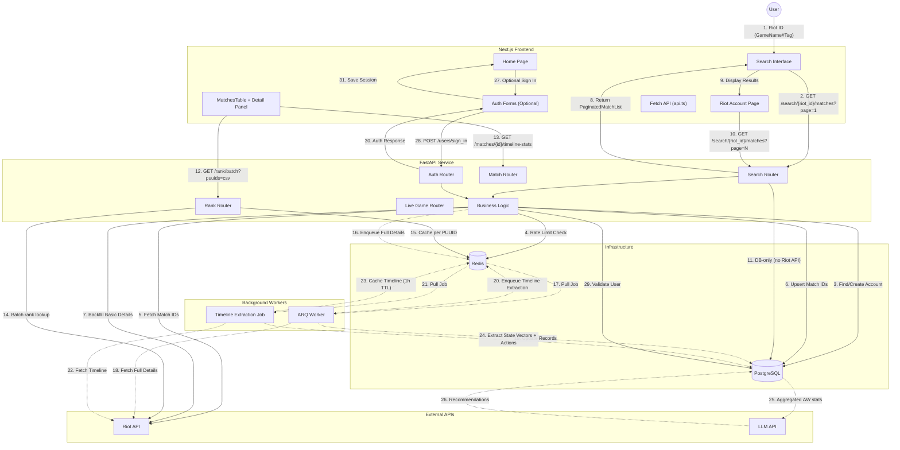

# Request Flow: Search to Home (with Optional Auth)

**Last Updated:** March 5, 2026

This document outlines the high-level request flow for the `league-match-analyzer` application, illustrating how services and technologies interact across search, match display, live game, and LLM analysis flows.

## System Components

- **Frontend**: Next.js 16 (App Router + Client Hooks, CSS Modules, recharts)
- **Backend**: FastAPI (Async Python, SQLModel, Pydantic v2)
- **Worker**: ARQ (Async Redis Queue)
- **Infrastructure**: PostgreSQL 16 (pgvector), Redis 7 (Cache/Queue/Rate Limits)
- **External**: Riot Games API, LLM API (Claude)

## High-Level Flow Diagram


```mermaid
graph TD
  %% Nodes
  User((User))

  subgraph Frontend ["Next.js Frontend"]
    Search["Search Interface"]
    Home["Home Page"]
    RiotAccount["Riot Account Page"]
    Auth["Auth Forms (Optional)"]
    MatchTable["MatchesTable + Detail Panel"]
    Fetch["Fetch API (api.ts)"]
  end

  subgraph Backend ["FastAPI Service"]
    SearchRoute["Search Router"]
    AuthRoute["Auth Router"]
    MatchRoute["Match Router"]
    RankRoute["Rank Router"]
    LiveRoute["Live Game Router"]
    Service["Business Logic"]
  end

  subgraph Infra ["Infrastructure"]
    DB[("PostgreSQL")]
    Redis[("Redis")]
  end

  subgraph Workers ["Background Workers"]
    ARQ["ARQ Worker"]
    TimelineJob["Timeline Extraction Job"]
  end

  subgraph External ["External APIs"]
    Riot["Riot API"]
    LLM["LLM API"]
  end

  %% Primary Search Flow
  User -- "1. Riot ID (GameName#Tag)" --> Search
  Search -- "2. GET /search/{riot_id}/matches?page=1" --> SearchRoute
  SearchRoute --> Service
  Service -- "3. Find/Create Account" --> DB
  Service -- "4. Rate Limit Check" --> Redis
  Service -- "5. Fetch Match IDs" --> Riot
  Service -- "6. Upsert Match IDs" --> DB
  Service -- "7. Backfill Basic Details" --> Riot
  SearchRoute -- "8. Return PaginatedMatchList" --> Search
  Search -- "9. Display Results" --> RiotAccount

  %% Pagination (Page 2+)
  RiotAccount -- "10. GET /search/{riot_id}/matches?page=N" --> SearchRoute
  SearchRoute -- "11. DB-only (no Riot API)" --> DB

  %% Match Detail Expansion
  MatchTable -- "12. GET /rank/batch?puuids=csv" --> RankRoute
  MatchTable -- "13. GET /matches/{id}/timeline-stats" --> MatchRoute
  RankRoute -- "14. Batch rank lookup" --> Riot
  RankRoute -- "15. Cache per PUUID" --> Redis

  %% Background Tasks (Async)
  Service -. "16. Enqueue Full Details" .-> Redis
  Redis -. "17. Pull Job" .-> ARQ
  ARQ -. "18. Fetch Full Details" .-> Riot
  ARQ -. "19. Update Records" .-> DB

  %% Timeline Extraction Pipeline
  ARQ -. "20. Enqueue Timeline Extraction" .-> Redis
  Redis -. "21. Pull Job" .-> TimelineJob
  TimelineJob -. "22. Fetch Timeline" .-> Riot
  TimelineJob -. "23. Cache Timeline (1h TTL)" .-> Redis
  TimelineJob -. "24. Extract State Vectors + Actions" .-> DB

  %% Future: LLM Analysis
  DB -. "25. Aggregated ΔW stats" .-> LLM
  LLM -. "26. Recommendations" .-> DB

  %% Optional Auth Flow
  Home -- "27. Optional Sign In" --> Auth
  Auth -- "28. POST /users/sign_in" --> AuthRoute
  AuthRoute --> Service
  Service -- "29. Validate User" --> DB
  AuthRoute -- "30. Auth Response" --> Auth
  Auth -- "31. Save Session" --> Home
```

## Request Flows

### 1. Search Flow (Page 1)

```
User → Riot ID (GameName#Tag) → GET /search/{riot_id}/matches?page=1
  → find_or_create_riot_account (DB upsert)
  → Rate limit check (Redis sliding window)
  → Fetch match IDs (Riot API)
  → Upsert match IDs (DB)
  → Backfill basic details inline (Riot API)
  → Return PaginatedMatchList { data, meta: { page, limit, total, last_page } }
```

### 2. Pagination (Page 2+)

```
User → Page N → GET /search/{riot_id}/matches?page=N
  → Resolve riot account from DB (no Riot API call)
  → Return PaginatedMatchList from DB
```

### 3. Match Detail Expansion

When the user clicks a match row in `MatchesTable`, the right-side `MatchDetailPanel` opens and triggers parallel fetches:

```
MatchesTable → selectedMatchId changes →
  1. GET /rank/batch?puuids=<csv>  → Redis cache check → Riot API (cache miss only)
  2. GET /matches/{matchId}/timeline-stats?participant_id=N → Redis cache → Riot timeline
  3. Champion data: apiGet(/champions/{id}) for missing champion IDs (client-side cache)
```

### 4. Background Job Chain

```
match_sync → enqueue fetch_match_details_job → ARQ worker
  → Fetch full match detail (Riot API) → Upsert (DB)
  → [Future] Enqueue extract_match_timeline_job
      → Fetch timeline (Riot API, cached 1h in Redis)
      → Extract per-minute state vectors (PlayerState + TeamState)
      → Extract discrete actions (item purchases + objective kills)
      → Persist to match_state_vector + match_action tables
```

### 5. Live Game Flow

```
User → GET /live-game/{riot_id} (SSE stream)
  → Resolve PUUID from Riot Account API
  → Fetch spectator data from Riot Spectator API
  → Fetch summoner ranks concurrently via asyncio.gather
  → Stream live game state via Server-Sent Events
  → Frontend renders LiveGameCard
```

### 6. LLM Analysis Flow (Future — Steps 3–7)

```
Stored state vectors + actions →
  → Score via win probability model: w(x) → ΔW(d) = w(z) - w(x)
  → Aggregate: mean ΔW per (champion, action, rank), K≥50 threshold
  → Compare summoner choices vs. population-optimal alternatives
  → Submit gap analysis to LLM (Claude)
  → Store recommendations in llm_analysis table
```

### 7. Optional Auth Flow

```
User → POST /users/sign_in → Validate (DB) → Return session
User → POST /users/sign_up → Create (DB) → Return session
Frontend → Save to sessionStorage → useSession hook
```

## Detailed Technology Stack

### 1. Frontend Layer

- **Next.js 16 & React 19**: App Router with `app/` directory structure
- **Pages**: `/` (search + optional auth), `/home` (match dashboard), `/riot-account/[riotId]` (search results)
- **API Client** (`src/lib/api.ts`): Typed `apiGet<T>` / `apiPost<T>` wrappers with error normalization
- **Client Cache** (`src/lib/cache.ts`): In-memory LRU-like cache with TTL
- **Session Storage**: `sessionStorage`-backed `useSession` hook for optional auth state
- **Error Handling** (`src/lib/errors/`): `ApiError` class, `buildApiErrorFromResponse`, `formatApiError` with `DETAIL_MESSAGES` lookup, `useAppError(scope)` hook
- **Match History UX**: `MatchesTable` (table + tabs + pagination) with `MatchDetailPanel` side overlay rendering decomposed `MatchCard` (ItemSlot, Teams, ChampionKdaChart sub-components)
- **Component Structure**: Folderized in `src/components/` — `Auth/`, `FeatureCard/`, `Header/`, `LiveGameCard/`, `MatchCard/`, `MatchDetailPanel/`, `MatchRow/`, `MatchesTable/`, `Pagination/`, `SearchBar/`, `SubHeader/`
- **Charts**: recharts for Champion KDA history bar charts

### 2. API Layer

- **FastAPI Routers**: `search`, `matches`, `auth`, `users`, `champions`, `rank`, `live_game`, `ops`, `reset`, `match_detail_enqueue`
- **Search Router**: Orchestrates search-first flow via `find_or_create_riot_account`, supports `?page=N&limit=N` pagination; Riot API sync gated to page 1 only
- **Rank Router**: `GET /rank/batch?puuids=<csv>` — concurrent batch lookup with per-PUUID Redis caching (1h TTL)
- **Match Router**: `GET /matches/{matchId}/timeline-stats?participant_id=N` — compact laning phase analytics (CS/gold diffs at 10/15 min)
- **Live Game Router**: SSE-based live game streaming with concurrent rank fetching
- **Rate Limiting**: `RiotRateLimiter` — Redis-backed sliding window with dynamic header parsing and global backoff

### 3. Data Synchronization Strategy

- **Stateless Lookup**: Search works without prior user registration
- **Idempotent Upsert**: `find_or_create_riot_account` ensures data consistency
- **Hybrid Backfill**:
  - **Inline**: Basic match details fetched immediately for UI responsiveness
  - **Background**: Full match details enqueued for async processing via ARQ
- **Timeline Extraction**: Separate background job extracts state vectors and actions from timeline data, persists to dedicated tables for downstream ΔW computation

### 4. Asynchronous Processing

- **ARQ & Redis**: Background job queue for heavy operations
- **Job Types**:
  - `fetch_match_details_job`: Batch match detail fetching from Riot API
  - `extract_match_timeline_job`: Timeline ingest → state vector + action extraction → DB persistence (idempotent)
  - **Cron**: `sync_all_riot_accounts_matches` runs every 6 hours
- **Timeline Caching**: Raw timeline payloads (~1MB) cached in Redis with 1h TTL to avoid redundant Riot API calls

### 5. Database Architecture

- **PostgreSQL 16**: Primary store with hybrid relational + JSONB approach
- **Core Tables**: `user`, `riot_account`, `match` (with `game_info` JSONB), `riot_account_match`, `user_riot_account`, `champion`
- **LLM Pipeline Tables** (new): `match_state_vector` (per-minute game state features), `match_action` (item purchases + objective kills with ΔW scoring columns), `llm_analysis` (LLM recommendations with schema versioning)
- **pgvector**: Extension enabled for future vector search
- **Alembic**: Async migration environment with Railway pre-deploy release step

## Key Implementation Details

### Search-First Pattern

- Users can search any Riot ID without registration
- Account and match data are created/updated on-demand
- Authentication is optional and only required for persistent features

### Rate Limiting Compliance

- **Redis-backed sliding window** algorithm tracks Riot API quotas
- **Dynamic configuration** adapts to `X-App-Rate-Limit` and `X-Method-Rate-Limit` headers
- **Global backoff** respects `Retry-After` headers across all workers

### Background Job Integration

- **Immediate response**: Basic match data returned quickly for UI
- **Progressive enhancement**: Full details populated asynchronously
- **Reliability**: Jobs retry on failure with exponential backoff
- **Pipeline extension**: Timeline extraction job chains after match detail fetching

### LLM Data Pipeline (In Progress)

- **Completed** (Phase 0): Ingest + Extract — state vector and action extraction from Riot timelines
- **Next**: Win probability model training, ΔW scoring, aggregation, LLM prompt submission
- **Design**: See `docs/LLM_DATA_PIPELINE.md` for the full 8-step pipeline specification
