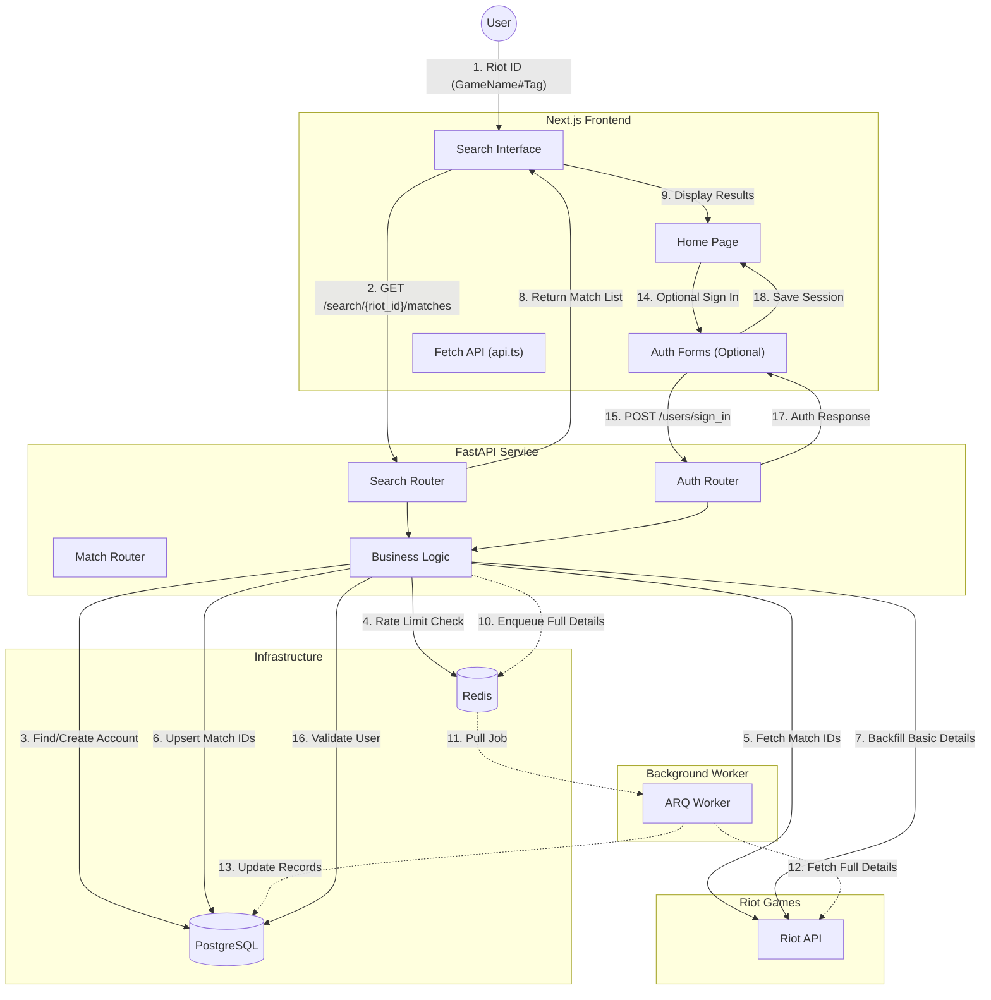

# Request Flow: Search to Home (with Optional Auth)

This document outlines the high-level request flow for the `league-match-analyzer` application, specifically illustrating how microservices and technologies interact when a user searches for match data and optionally signs in for persistent features.

## System Components

- **Frontend**: Next.js 16 (React Server Components + Client Hooks)
- **Backend**: FastAPI (Async Python)
- **Worker**: ARQ (Async Redis Queue)
- **Infrastructure**: PostgreSQL (Data), Redis (Cache/Queue/Rate Limits)
- **External**: Riot Games API

## High-Level Flow Diagram

## Detailed Technology Stack Flow

### 1. Frontend Layer

- **Next.js & React**: The search interface allows immediate Riot ID input without authentication
- **Fetch API**: `api.ts` handles HTTP requests with client-side caching and session management
- **Session Storage**: Optional user sessions stored in `sessionStorage` for persistent features

### 2. API Layer

- **FastAPI**: Receives the primary request on `/search/{riot_id}/matches`
- **Search Router**: Orchestrates the search-first flow using `find_or_create_riot_account`
- **Auth Router**: Handles optional `/users/sign_in` and `/users/sign_up` endpoints
- **Rate Limiting**: `RiotApiClient` uses **Redis** to track request quotas and prevent 429 errors

### 3. Data Synchronization Strategy

- **Stateless Lookup**: Search works without prior user registration
- **Idempotent Upsert**: `find_or_create_riot_account` ensures data consistency
- **Hybrid Backfill**:
  - **Inline**: Basic match details fetched immediately for UI responsiveness
  - **Background**: Full match details enqueued for async processing

### 4. Asynchronous Processing

- **ARQ & Redis**: Heavy operations (fetching full match details) are offloaded to background jobs
- **Worker Service**: Separate process picks up jobs, fetches data from **Riot**, and performs upserts into **PostgreSQL**
- **Job Types**: `fetch_match_details_job` for batch processing, `sync_all_riot_accounts_matches` for periodic updates

### 5. Database Architecture

- **PostgreSQL**: Primary store with hybrid relational + JSONB approach
- **JSONB Storage**: Raw Riot payloads stored in `Match.game_info` for flexibility
- **Many-to-Many**: `RiotAccountMatch` join table for efficient querying
- **pgvector**: Extension enabled for future vector search capabilities

## Key Implementation Details

### Search-First Pattern

The application prioritizes immediate access to match data:

- Users can search any Riot ID without registration
- Account and match data are created/updated on-demand
- Authentication is optional and only required for persistent features

### Rate Limiting Compliance

- **Redis-backed sliding window** algorithm tracks Riot API quotas
- **Dynamic configuration** adapts to `X-App-Rate-Limit` and `X-Method-Rate-Limit` headers
- **Global backoff** respects `Retry-After` headers across all workers

### Background Job Integration

- **Immediate response**: Basic match data returned quickly for UI
- **Progressive enhancement**: Full details populated asynchronously
- **Reliability**: Jobs retry on failure with exponential backoff
