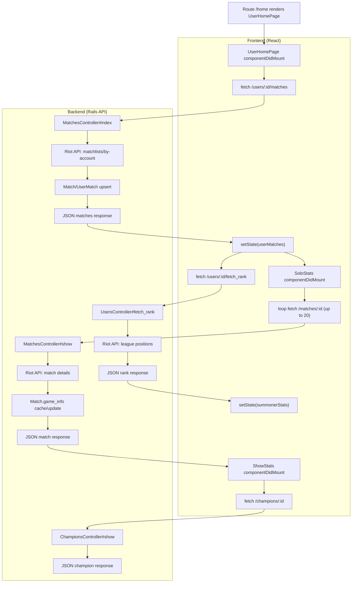

## Home Page Roundtrip Diagram

```mermaid
graph TD
  routeHome["Route /home renders UserHomePage"] --> userHomeMount["UserHomePage componentDidMount"]

  subgraph frontend["Frontend (React)"]
    userHomeMount
    fetchMatches["fetch /users/:id/matches"]
    fetchRank["fetch /users/:id/fetch_rank"]
    setMatches["setState(userMatches)"]
    setRank["setState(summonerStats)"]
    soloStatsMount["SoloStats componentDidMount"]
    fetchMatchLoop["loop fetch /matches/:id (up to 20)"]
    showStatsMount["ShowStats componentDidMount"]
    fetchChampion["fetch /champions/:id"]
  end

  subgraph backend["Backend (Rails API)"]
    matchesIndex["MatchesController#index"]
    riotMatchList["Riot API: matchlists/by-account"]
    matchUpsert["Match/UserMatch upsert"]
    matchesIndexResp["JSON matches response"]

    fetchRankRoute["UsersController#fetch_rank"]
    riotRank["Riot API: league positions"]
    fetchRankResp["JSON rank response"]

    matchShow["MatchesController#show"]
    riotMatchDetail["Riot API: match details"]
    matchCache["Match.game_info cache/update"]
    matchShowResp["JSON match response"]

    championShow["ChampionsController#show"]
    championResp["JSON champion response"]
  end

  userHomeMount --> fetchMatches
  fetchMatches --> matchesIndex
  matchesIndex --> riotMatchList
  riotMatchList --> matchUpsert
  matchUpsert --> matchesIndexResp
  matchesIndexResp --> setMatches
  setMatches --> fetchRank
  fetchRank --> fetchRankRoute
  fetchRankRoute --> riotRank
  riotRank --> fetchRankResp
  fetchRankResp --> setRank

  setMatches --> soloStatsMount
  soloStatsMount --> fetchMatchLoop
  fetchMatchLoop --> matchShow
  matchShow --> riotMatchDetail
  riotMatchDetail --> matchCache
  matchCache --> matchShowResp

  matchShowResp --> showStatsMount
  showStatsMount --> fetchChampion
  fetchChampion --> championShow
  championShow --> championResp
```
