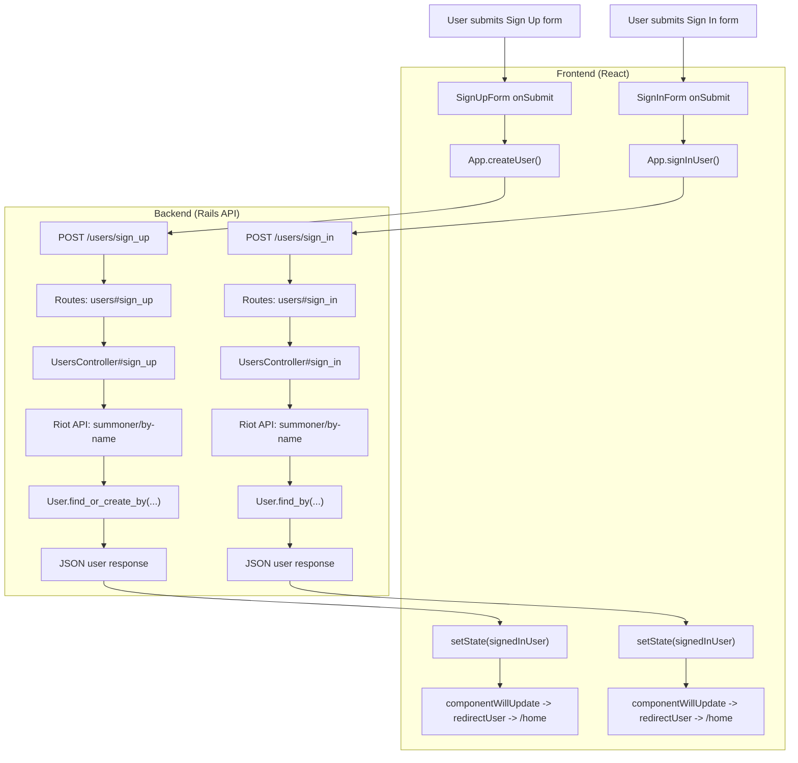

## Sign-Up vs Sign-In Request Flows Diagram

```mermaid
graph TD
  userSignUp["User submits Sign Up form"] --> signUpForm["SignUpForm onSubmit"]
  userSignIn["User submits Sign In form"] --> signInForm["SignInForm onSubmit"]

  subgraph frontend["Frontend (React)"]
    signUpForm --> createUser["App.createUser()"]
    signInForm --> signInUser["App.signInUser()"]
    setStateUp["setState(signedInUser)"]
    setStateIn["setState(signedInUser)"]
    redirectUp["componentWillUpdate -> redirectUser -> /home"]
    redirectIn["componentWillUpdate -> redirectUser -> /home"]
  end

  subgraph backend["Backend (Rails API)"]
    signUpReq["POST /users/sign_up"]
    signUpRoute["Routes: users#sign_up"]
    signUpController["UsersController#sign_up"]
    riotSummonerUp["Riot API: summoner/by-name"]
    userCreate["User.find_or_create_by(...)"]
    signUpResp["JSON user response"]

    signInReq["POST /users/sign_in"]
    signInRoute["Routes: users#sign_in"]
    signInController["UsersController#sign_in"]
    riotSummonerIn["Riot API: summoner/by-name"]
    userFind["User.find_by(...)"]
    signInResp["JSON user response"]
  end

  createUser --> signUpReq
  signUpReq --> signUpRoute
  signUpRoute --> signUpController
  signUpController --> riotSummonerUp
  riotSummonerUp --> userCreate
  userCreate --> signUpResp
  signUpResp --> setStateUp
  setStateUp --> redirectUp

  signInUser --> signInReq
  signInReq --> signInRoute
  signInRoute --> signInController
  signInController --> riotSummonerIn
  riotSummonerIn --> userFind
  userFind --> signInResp
  signInResp --> setStateIn
  setStateIn --> redirectIn
```
