## Sign In to Home Request Flow (Phase 4 Architecture)

Complete request flow from user authentication on `/` through loading `/home` with all MatchCards rendered, including the new search functionality.

> **Architecture Note**: This codebase separates **App Identity** (User) from **Riot Identity** (RiotAccount). A User represents an app account with an email, while a RiotAccount stores Riot profile data (PUUID, summoner name, etc.). The `UserRiotAccount` join table links them in a many-to-many relationship, enabling future multi-account support.
>
> **Phase 4 Changes**:
> - Removed polling mechanism — matches now render immediately via inline backfill
> - Match endpoints changed from `/users/{userId}/matches` to `/riot-accounts/{riotAccountId}/matches`
> - Added `/search/{riotId}/matches` for stateless account lookup
> - All match associations now use `RiotAccountMatch` instead of `UserMatch`

### Participants

**Frontend (Next.js)**

| Participant | Description |
|---|---|
| `AuthForm` | Sign in/up form component (`handleSubmit`) |
| `HomePage` | `/home` dashboard page (`loadOverview`, search functionality) |
| `MatchCard` | Individual match display card |
| `api.ts` | API client with caching (`apiGet`, `apiPost`, `buildUrl`) |
| `sessionStorage` | Browser session persistence (`saveSessionUser`, `loadSessionUser`) |
| `user-utils.ts` | User helper functions (`getRiotAccountId`, `getUserDisplayName`, `getUserPuuid`) |

**Backend (FastAPI)**

| Participant | Description |
|---|---|
| `auth.py` | Auth router — `sign_in()`, `sign_up()` endpoints |
| `matches.py` | Match router — `list_riot_account_matches()` endpoint |
| `search.py` | Search router — `search_riot_account_matches()`, `search_riot_account()` endpoints |
| `users.py` | User router — user-related endpoints |
| `champions.py` | Champion router — `get_champion()` endpoint |
| `Services` | Business logic — `riot_sync`, `riot_account_upsert`, `match_sync`, `enqueue_match_details` |
| `ARQ Worker` | Background job processor — `fetch_match_details_job()` |

**External**

| Participant | Description |
|---|---|
| `Riot API` | Riot Games API (account, summoner, match, rank endpoints) |
| `PostgreSQL` | Application database (User, RiotAccount, UserRiotAccount, Match, RiotAccountMatch, Champion tables) |

### Diagram

```mermaid
sequenceDiagram
    actor User

    box "Frontend (Next.js)"
        participant AF as "AuthForm"
        participant HP as "HomePage"
        participant MC as "MatchCard"
        participant api as "api.ts"
        participant ss as "sessionStorage"
    end

    box "Backend (FastAPI)"
        participant AR as "auth.py"
        participant MR as "matches.py"
        participant UR as "users.py"
        participant CR as "champions.py"
        participant SVC as "Services"
        participant WK as "ARQ Worker"
    end

    box "External"
        participant RIOT as "Riot API"
        participant DB as "PostgreSQL"
    end

    Note over User,DB: Phase 1 — Sign In on /

    User->>AF: Enter riotId + email, click Sign In
    AF->>AF: handleSubmit() validates fields
    AF->>api: apiPost("/users/sign_in", payload)
    api->>api: buildUrl("/users/sign_in")
    api->>AR: POST /users/sign_in
    AR->>AR: parse_riot_id(summoner_name)
    AR->>SVC: fetch_sign_in_user(session, riot_id, email)
    SVC->>DB: SELECT user WHERE email
    DB-->>SVC: User (or None)
    Note right of SVC: Verify riot_account is linked to user
    SVC->>DB: SELECT riot_account JOIN user_riot_account<br/>WHERE user_id AND riot_id
    DB-->>SVC: RiotAccount (or None)
    alt User or RiotAccount not found
        SVC-->>AR: None
        AR-->>api: 404 User not found
    else Credentials valid
        SVC->>RIOT: fetch_account_by_riot_id(gameName, tagLine)
        RIOT-->>SVC: puuid, gameName, tagLine
        SVC->>RIOT: fetch_summoner_by_puuid(puuid)
        RIOT-->>SVC: profileIconId, summonerLevel
        SVC->>SVC: upsert_riot_account(riot_id, puuid, summoner_info)
        SVC->>DB: UPDATE riot_account SET summoner_name, profile_icon_id, etc
        DB-->>SVC: RiotAccount
        SVC-->>AR: (User, RiotAccount)
        AR-->>api: AuthResponse JSON {id, email, riot_account}
        api-->>AF: UserSession
        AF->>HP: onAuthSuccess(user)
        HP->>HP: handleAuthSuccess(user)
        HP->>ss: saveSessionUser(user)
        HP->>HP: router.push("/home")
    end

    Note over User,DB: Phase 2 — Load /home Dashboard

    HP->>ss: loadSessionUser()
    ss-->>HP: UserSession {id, email, riot_account}
    HP->>HP: getRiotAccountId(user) → riot_account.id
    HP->>HP: loadOverview()

    par Fetch Matches
        HP->>api: apiGet("/riot-accounts/{riotAccountId}/matches")
        api->>MR: GET /riot-accounts/{riotAccountId}/matches
        MR->>SVC: fetch_match_list_for_riot_account(session, riot_account_id, 0, 20)
        SVC->>SVC: resolve_riot_account_identifier(riot_account_id)
        SVC->>DB: SELECT riot_account WHERE id OR riot_id
        DB-->>SVC: RiotAccount
        SVC->>RIOT: fetch_match_ids_by_puuid(puuid, 0, 20)
        RIOT-->>SVC: match ID list
        SVC->>SVC: upsert_matches_for_riot_account(riot_account_id, match_ids)
        SVC->>DB: UPSERT INTO match, riot_account_match
        Note right of MR: BackgroundTasks enqueued after response
        MR->>SVC: enqueue_missing_detail_jobs(match_ids)
        SVC->>DB: SELECT WHERE game_info IS NULL
        DB-->>SVC: missing match IDs
        SVC->>WK: enqueue_job("fetch_match_details_job", batch)
        MR->>SVC: list_matches_for_riot_account(session, riot_account.id)
        SVC->>DB: SELECT matches JOIN riot_account_match<br/>ORDER BY timestamp DESC
        DB-->>SVC: Match[]
        Note right of MR: Inline backfill for immediate render
        MR->>SVC: backfill_match_details_inline(session, matches)
        SVC->>RIOT: fetch_match_by_id(match_id) for missing
        RIOT-->>SVC: Full match payload
        SVC->>DB: UPDATE match SET game_info
        MR-->>api: MatchListItem[]
        api-->>HP: MatchSummary[]
    and Fetch Rank
        HP->>api: apiGet("/riot-accounts/{riotAccountId}/fetch_rank")
        api->>UR: GET /riot-accounts/{riotAccountId}/fetch_rank
        UR->>SVC: fetch_rank_for_riot_account(session, riot_account_id)
        SVC->>SVC: resolve_riot_account_identifier(riot_account_id)
        SVC->>DB: SELECT riot_account WHERE id
        DB-->>SVC: RiotAccount
        SVC->>RIOT: fetch_rank_by_puuid(puuid)
        RIOT-->>SVC: tier, rank, leaguePoints
        UR-->>api: RankInfo
        api-->>HP: RankInfo
    end

    HP->>HP: setMatches(), setRank()

    Note over User,DB: Phase 3 — Seed Details (No Polling Needed)

    HP->>HP: Seed matchDetails from existing game_info
    Note right of HP: With inline backfill, all matches<br/>already have game_info populated

    Note over WK,DB: Background — ARQ Worker (for future updates)
    loop For each batch of missing match IDs (if any remain)
        WK->>RIOT: fetch_match_by_id(match_id)
        RIOT-->>WK: Full match payload with participants
        WK->>DB: UPDATE match SET game_info, game_start_timestamp
    end

    Note right of HP: Polling removed - matches render immediately<br/>due to backfill_match_details_inline()

    Note over User,DB: Phase 4 — Render MatchCards

    HP->>MC: MatchCard(match, detail, user)
    MC->>MC: getParticipantForUser(detail, user)
    MC->>MC: getKdaRatio(participant)
    MC->>MC: getCsPerMinute(participant)
    MC->>api: apiGet("/champions/{championId}")
    api->>CR: GET /champions/{championId}
    CR->>SVC: get_champion_by_id(session, champ_id)
    SVC->>DB: SELECT champion WHERE champ_id
    DB-->>SVC: Champion
    CR-->>api: ChampionPublic
    api-->>MC: Champion data
    MC-->>User: Rendered MatchCard with champion, KDA, CS/min

    Note over User,DB: Phase 5 — Search for Other Players (Optional)

    User->>HP: Enter riot ID in search box, click Search
    HP->>HP: handleSearch(riotId)
    HP->>api: apiGet("/search/{encodedRiotId}/matches")
    api->>SR: GET /search/{riotId}/matches
    SR->>SR: parse_riot_id(riot_id)
    SR->>RIOT: fetch_account_by_riot_id(gameName, tagLine)
    RIOT-->>SR: puuid, gameName, tagLine
    SR->>RIOT: fetch_summoner_by_puuid(puuid)
    RIOT-->>SR: profileIconId, summonerLevel
    SR->>RIOT: fetch_match_ids_by_puuid(puuid, 0, 20)
    RIOT-->>SR: match ID list
    SR->>SVC: find_or_create_riot_account(riot_id, puuid, summoner_info)
    SVC->>DB: SELECT or INSERT riot_account
    DB-->>SVC: RiotAccount
    SR->>SVC: upsert_matches_for_riot_account(riot_account_id, match_ids)
    SVC->>DB: UPSERT INTO match, riot_account_match
    SR->>SVC: list_matches_for_riot_account(session, riot_account.id)
    SVC->>DB: SELECT matches JOIN riot_account_match
    DB-->>SVC: Match[]
    SR->>SVC: backfill_match_details_inline(session, matches)
    SVC->>RIOT: fetch_match_by_id(match_id) for missing
    RIOT-->>SVC: Full match payload
    SVC->>DB: UPDATE match SET game_info
    SR-->>api: MatchListItem[]
    api-->>HP: MatchSummary[]
    HP->>HP: setSearchedAccount(riot_id), setMatches(results)
    Note right of HP: UI switches to display searched account's matches
    HP->>MC: MatchCard(match, detail, searchedUser)
    MC-->>User: Display searched player's matches
```



### Key Implementation Details

**Identity Separation Architecture**
- **User Table**: App identity with email (unique index)
- **RiotAccount Table**: Riot identity with riot_id, puuid (unique indexes)
- **UserRiotAccount Table**: Many-to-many join table linking users to riot accounts
- **RiotAccountMatch Table**: Links riot accounts to matches (replaces UserMatch)
- **Design Goal**: Enables future multi-account support and separates auth from game data

**Caching Strategy**
- Frontend `api.ts` uses an in-memory `Map` with configurable TTL (default 60s)
- GET requests cache by default; POST requests never cache
- Refresh button clears cache via `clearCache()`

**Match Detail Loading Strategy**
- **Inline Backfill**: `backfill_match_details_inline()` fetches missing `game_info` directly from Riot API during the request
- **Result**: Matches render immediately without polling delays
- **Background Jobs**: Still enqueued via ARQ for future updates and resilience
- **Batching**: Missing match IDs batched in groups of 5 with deterministic job IDs for deduplication

**Search Functionality**
- New `/search/{riot_id}/matches` endpoint for stateless account lookup
- Finds or creates riot account without linking to any user
- Enables viewing other players' match history
- Uses same inline backfill strategy for immediate results

**Session Management**
- Uses browser `sessionStorage` with key `league.session.user`
- Stores `AuthResponse`: `{id, email, riot_account: {...}}`
- No JWT or token auth — session is client-side only
- Missing session on `/home` redirects to `/`
- Frontend uses `getRiotAccountId(user)` to extract riot_account.id for API calls

### Database Schema Changes

**Old Architecture (Phase 3)**
```
User
- id (PK)
- email
- summoner_name
- riot_id (unique)
- puuid (unique)
- profile_icon_id
- summoner_level

UserMatch (join table)
- user_id → User.id
- match_id → Match.id
```

**New Architecture (Phase 4)**
```
User (app identity only)
- id (PK)
- email (unique)

RiotAccount (Riot identity)
- id (PK)
- riot_id (unique)
- puuid (unique)
- summoner_name
- profile_icon_id
- summoner_level

UserRiotAccount (many-to-many join)
- id (PK)
- user_id → User.id
- riot_account_id → RiotAccount.id
- UNIQUE(user_id, riot_account_id)

RiotAccountMatch (join table)
- id (PK)
- riot_account_id → RiotAccount.id
- match_id → Match.id
- UNIQUE(riot_account_id, match_id)
```

**Migration Strategy**
- New migration: `20260212_0001_clean_slate_shared_riot_accounts.py`
- Old migrations removed: phase2_models, add_match_timestamp, backfill_game_start_timestamp
- Services refactored: `riot_user_upsert.py` → `riot_account_upsert.py`, new `riot_accounts.py`

### API Endpoint Changes

| Old Endpoint | New Endpoint | Change |
|---|---|---|
| `POST /users/sign_in` | `POST /users/sign_in` | Response changed to `AuthResponse` |
| `POST /users/sign_up` | `POST /users/sign_up` | Response changed to `AuthResponse` |
| `GET /users/{userId}/matches` | `GET /riot-accounts/{riotAccountId}/matches` | Route changed to riot-accounts |
| `GET /users/{userId}/fetch_rank` | `GET /riot-accounts/{riotAccountId}/fetch_rank` | Route changed to riot-accounts |
| N/A | `GET /search/{riotId}/matches` | **NEW** — Stateless search |
| N/A | `GET /search/{riotId}/account` | **NEW** — Account info only |

### Service Function Changes

| Old Function | New Function | Key Difference |
|---|---|---|
| `upsert_user_from_riot()` | `upsert_user_and_riot_account()` | Creates/links both User and RiotAccount |
| `fetch_match_list_for_user()` | `fetch_match_list_for_riot_account()` | Uses riot_account_id instead of user_id |
| `list_matches_for_user()` | `list_matches_for_riot_account()` | Joins via riot_account_match |
| `upsert_matches_for_user()` | `upsert_matches_for_riot_account()` | Creates riot_account_match links |
| N/A | `find_or_create_riot_account()` | Minimal upsert without user linkage |
| N/A | `ensure_user_riot_account_link()` | Creates UserRiotAccount link |
| N/A | `backfill_match_details_inline()` | **NEW** — Synchronous match detail fetch |
