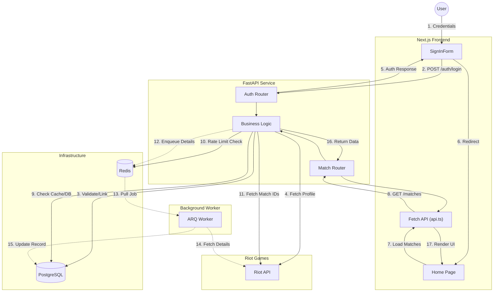

# Request Flow: Sign In to Home

This document outlines the high-level request flow for the `league-match-analyzer` application, specifically illustrating how microservices and technologies interact when a user signs in and loads their match history on the home page.

## System Components

*   **Frontend**: Next.js 16 (React Server Components + Client Hooks)
*   **Backend**: FastAPI (Async Python)
*   **Worker**: ARQ (Async Redis Queue)
*   **Infrastructure**: PostgreSQL (Data), Redis (Cache/Queue/Rate Limits)
*   **External**: Riot Games API

## High-Level Flow Diagram

## detailed Technology Stack Flow

### 1. Frontend Layer
*   **Next.js & React**: The `/home` page initializes. `useEffect` triggers data fetching.
*   **Fetch API**: `api.ts` handles the HTTP request, checking the client-side cache first.

### 2. API Layer
*   **FastAPI**: Receives the request on `/riot-accounts/{id}/matches`.
*   **Service Layer**: Orchestrates data retrieval. It checks **PostgreSQL** for existing data and queries the **Riot API** for updates.
*   **Rate Limiting**: The `RiotApiClient` uses **Redis** to track request quotas and prevent 429 errors.

### 3. Asynchronous Processing
*   **ARQ & Redis**: Heavy operations (fetching full match details) are offloaded. The API enqueues a job into **Redis**.
*   **Worker Service**: A separate process picks up the job, fetches data from **Riot**, and performs an upsert into **PostgreSQL**.
